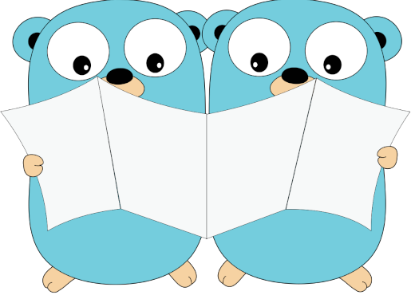

# emailsync
This project creates an API to syncronize a list of emails from a MockAPI to a MailChimp List in Go.

## Technical Design

Please refer to the [Techincal Design](https://docs.google.com/document/d/1Ux-Ch0fFvVzamrrz3h372Nb88hnRzrW_g-CLpRFTTQU/edit?usp=sharing) to understand the detail of architecure and implementation.

## OpenAPI specification

The directory ``/doc`` is a OpenAPI specification of the API of **emailsync**.

You can access the API documentation and use it as a client when your service is running:
 - just type the service URL + ``/doc`` on your browser
 - avaiable when running on your local machine, not a serverless version.

You also can use OpenAPI specs in a variety of ways:
- Using as a test client on VS Code
  - Using extension from [philosowaffle.openapi-designer](https://marketplace.visualstudio.com/items?itemName=philosowaffle.openapi-designer)
  - And [OpenAPI (Swagger Editor)](https://marketplace.visualstudio.com/items?itemName=42Crunch.vscode-openapi)
- Import to Postman
- Generate test cases using OpenAPI Spec (stop writing tests!)
  - On Postman \([here is a tutorial](https://www.postman.com/postman-galaxy/dynamically-generate-tests-from-open-api-specs/)\)    
  - Using Python testRail \([here is a tutorial](https://www.youtube.com/watch?v=r9xnkv5WCYA&t=2215)\)

## Walking through video
